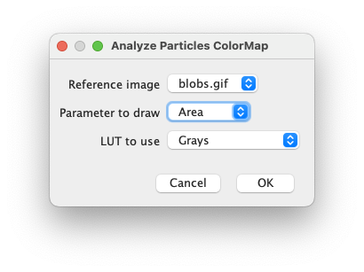
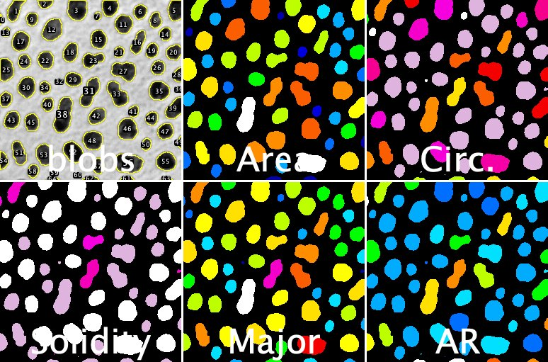

# Analyze Particles: ColorMap
*This plugin is aimed at providing a way to easiely get a visual map of parameters extracted from the ImageJ "Analyze Particles" function.*

## Installation
1. Make sure you are running at least **ImageJ v1.53s**: Update ImageJ using the "Help/Update ImageJ" menu.
2. Download the __Analyze_Particles_ColorMap.jar plugin__ from the [release page](https://github.com/fabricecordelieres/IJ-Plugin_Analyze-Particles-ColorMap/releases).
3. Drag-and-drop it to the ImageJ toolbar: a dialog box will pop-up, requesting the user to point at the destination folder. By default, the ImageJ/Plugins folder should be selected: press Ok to validate.

## How to use it ?
1. First, run the "Analyze Particles" function, making sure to have the two required outputs are generated:
* The outlines of the objects should be pushed to the Roi Manager
* Measurements should be pushed to the Results Table
* Both the Roi Manager and the Results Table should carry the same number of items.
2. With both outputs generated and the original image opened, launch the Analyze/Analyze Particles ColorMap plugin: the following interface should be displayed:

  

* ***Reference image***: select the original image.
* ***Parameter to draw***: select the parameter from the Results Table that will be serve as an intensity for each ROI on the output image.
* ***LUT to use***: select the LUT to apply to the output image.
3. The output image is generated.

   
  <i><b>Examples of outputs, based on the "blob" image</b></i>

# Versions
## 2020/08/03: Version 1.0
Initial release
